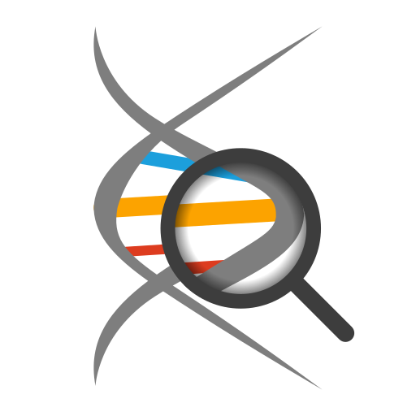

[](https://goreportcard.com/report/github.com/TheGreaterHeptavirate/motorola)
[](https://pkg.go.dev/mod/github.com/TheGreaterHeptavirate/motorola)
[](https://codecov.io/gh/TheGreaterHeptavirate/motorola)
[](https://quay.io/repository/gucio321/bialkomat)

Białkomat project is an application written for
the [Motorola Science Cup](https://science-cup.pl/) competition.

<p align="center">
<a href="https://science-cup.pl/"></a>

</p>

# Description

Białkomat is intended to be used for analyzing genetic code typed in or
loaded from source file. For more details, take a look at our [documentation](#documentation)
(*required knowledge of polish language*).

## Unique Selling Point (USP)

1. **Handy and self-contained** - binary is encapsulated in one
   executable file that does not depend on your OS\*
2. **High analysis quality** - Our project uses one of the most
   qualified, open-source [Bioinformatics library](https://github.com/biopython/biopython)
3. **Innovative technology** - the project is a unique combination of **4 programming languages**
   (GO, C, C++ and Python). Such a connection while being a kind of precedent on IT market, still ensures
   no additional system dependencies needs to be installed.

\* Check for [System Requirements](#system-requirements)

## Binaries usage

- Go to [the latest release](https://github.com/thegreaterheptavirate/motorola/releases/latest)
  and download the file appropiate for your OS.
- extract `.zip` file using any tool.
- run binary (`.exe` on Windows and `.bin` on linux).

### System requirements

In order to run one of our binaries, you need to either have
access to a 64-bit Windows or Linux Operating System.
We also require your OS to support OpenGL and have (at least) 0.5GB free disc space.

## Extra flags

You may want to specify some additional flags to see what happens inside of our program.

```console
Usage of ./motorola:
  -help
    	Show this message
  -i string
    	Load data from file
  -info
    	Print app info and exit
  -ll uint
    	Enforce log level
    	0 = Do not enforce (default)
    	1 = Debug (equal to -verbose)
    	2 = Info
    	3 = Warnings only
    	4 = Errors only
    	5 = Practically nothing (prints only fatal errors)

  -no-errors
    	Do not display error messages in app (messages will be logged anyway)
  -skip
    	Automatically skip to Proteins View mode (usually used together with -i)
  -verbose
    	verbose mode
  -version
    	print project's version
```

So, for example, to load file `path/to/data/file.txt` and immediately
show results in Proteins View (ignoring all the error messages)
you can use the following command `./motorla -i /path/to/dat/file.txt -no-errors -skip`.

# Documentation

Refer [to docs](./docs).

# STATUS

In reference to [this document](https://science-cup.pl/wp-content/uploads/2022/11/MSC3_2022_Bioinformatyka.pdf):
- [X] Genetic code reading (35 pts)
- [X] Proteins presentation (25 pts)
- [X] More plots and charts (65 pts)
- [X] Additional things:
    - [X] "Application architecture" (10 pts)
    - [X] documentation (10 pts)
    - [X] UI (25 pts)
    - [ ] Unit testing (5 pts)

# Compilation instruction

## Pre-requirements

### for building
- [go](https://go.dev)
- GCC
- mingw (**for cross-platform compilation only**)
- Python 3.11 (**NOTE** remember to add it to PATH on Windows)

## Source

```sh
# download source
git clone git@github.com:TheGreaterHeptavirate/motorola
# change-dir
cd motorola
# download go dependencies
make setup

# run app:
go run github.com/TheGreaterHeptavirate/motorola/cmd/motorola
# OR
cd cmd/motorola
go run .
```

### Python config
You may experience trouble with your binaries, because (for unknown reason)
not all operating systems support `python3-config` command that is used
for obtaining right flags. There for please take a quick look at our simple
configuration script:

```console
$ go run scripts/flags.go
Usage of /tmp/go-build4250335646/b001/exe/flags:
  -cflags string
    	manually specify CFLAGS
  -ldflags string
    	manually specify LDFLAGS
  -o string
    	output filename (required)
  -pycfg string
    	python3-config executable name/path
exit status 1
```

`-o` will be (most often) `pkt/python_integration/flags.go`
And now you need to figure out valid flags. You have three options:
- if your system has `pkg-config` configured, don't add any flags.
- if you know the exact location/name of `python3-config`-like script, specify `-pycfg`
- else you will need to pass the python3-include flags manually with `-ldflags` and `-cflags`
  lets explore this a bit more:
  * C flags specifies where your system should look for `Python.h` headers.
    Thats why it should be of the following form: `-Ipath/to/python311/includes/`, e.g.
    on Windows 10: `-IC:/Users/<your username>/AppData/Local/Programs/Python/Python311/include`
  * Linker flags are even more tricky. They should point to python libraries (DLLs on Windows and .so files on linux).
    Here is a value of `-ldflags` with that we managed to build Białkomat on Windows 10:
    `-LC:/Users/<your username>/AppData/Local/Programs/Python/Python311/libs -LC:/Users/<your username>/AppData/Local/Programs/Python/Python311 -lpython311 -lm`

## Alternative - `Docker`

**An official image is available as [`quay.io/gucio321/bialkomat`](https://quay.io/gucio321/bialkomat)**

As compilation in the way described above may be a bit painful on some operating systems (especially Windows :smile:)
We've introduced another way to run our application - [Docker](https://docker.io).

```sh
# start immediately
docker-compose up
# you can also construct a large docker command like this:
docker run --name=motorola_app_1 \
--security-opt label:type:container_runtime_t \
--network bridge \
-e DISPLAY=:0 \
-v /tmp/.X11-unix:/tmp/.X11-unix .
```

**NOTE** commands above are tested for [podman](https://podman.io),
but since it has the same api as docker, everything should work.

### Windows setup

If you wish to run the docker image on Windows, first of all refer to official docker instruction
for setting up Docker Desktop on Windows. Then, refer to [this page](https://dev.to/darksmile92/run-gui-app-in-linux-docker-container-on-windows-host-4kde)
to set up X enviroument and be able to display our app.

### important linux note

you need to disable access control for your X envirouemnt, otherwise it will not run:
```sh
xhost +
```
