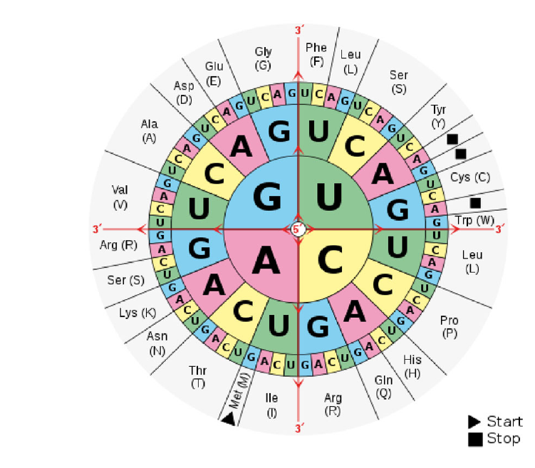
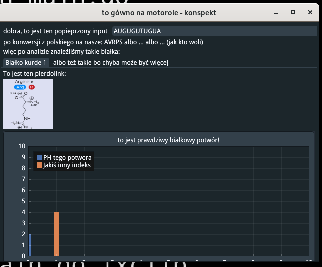

Language: pl

# INTRO

Ten dokument opisuje bardzo ogólną wizję
projektu BioIT do konkursu Motorola Science Cup.

# REFERENCJE

- [dokument opisujący zadanie](https://science-cup.pl/wp-content/uploads/2022/11/MSC3_2022_Bioinformatyka.pdf)

## TECHNOLOGIE

- Język: [GO](https://golang.org/)
- Framework Graficzny:
    * [giu](https://github.com/AllenDang/giu) (ewentualnie fork z autorskimi zmianami)
    * do wykresów [ImPlot](https://github.com/epezent/implot) (obecnie część giu)
- obsługa danych wejściowych (json): wbudowane narzędzia GO
- Framework do testów jednostkowych: [testify](https://github.com/stretchr/testify)

# WYKONANIE

odnoszę się tutaj do części PDFa z [referencjami](#referencje)

## Odczyt kodu genetycznego

### zczytanie z pliku/wejścia

nie powinno to sprawić praktycznie żadnych problemów.
wczytywanie takiego typu danych z pliku to bułka z masłem
a z "klawiatury" nie jest to trudniejsze (pole w aplikacji to pointer do stringa)

weryfikacja wprowadzonych danych - nie mogą zawierać nadprogramowych liter:
- A C G U dla RNA
- A C G T dla DNA
- jeżeli inna litera -> zgłoś błąd
- jeżeli zarówno T jak i U -> zgłoś błąd

wejściowe dane konwertujemy do wersji RNA żeby nie było
problemów z 2 typami

### dzielenie kodu na trójki (kodony)

jak mówi PDF:
"Ponieważ [...] można rozpocząć od dowolnego miejsca kodu,
Odczyt należy wykonać trzykrotnie" (z odpowiednim przesunięciem)

czyli:
* kod: `ABCDEFGH`
* v1: `ABC DEF`
* v2: `BCD EFG`
* v3: `CDE FGH`

### konwersja do na aminokwasy:

Poniższy schemat przedstawia sposób konwersji
kodonów (potrójnych sekwencji) na aminokwasy:


na tym etapie proponowałbym zrobić prostego JSONa
```json
[
    {
        "Codes": [
            "AAA",
            "AAG",
        ],
        "LongNam": "Lysocośtam",
        "ShortName": "lys",
        "Sign":"K"
    },
    {
        "Codes": [
            "UAG",
            "UAA",
            "UGA"
        ],
        "LongNam": "Kod STOP",
        "ShortName": "stop",
        "Sign":"STOP"
    },
]
```

proponowałbym teraz po stronie GO zrobić takie struktury:
- liste konstansów odpowiadających aminokwasom + string2enum który by
  konwertował znaczek z jsona do GO
- typ (`type` - jak klasa w innych językach) odpowiedzialny za
  "pasowanie" do jsona i wczytywanie go

i tak mielibyśmy już ładną pseudo bazedanych
i binding w GO

**EWENTUALNIE**

nie bawić się z JSONEM i od razu lecieć w GO
(wtedy baza byłaby jako plik `data.go`)

### Konwersja na białka

typ (klasa) BIAŁKO powinna być tablicą ww. aminokwasów.
za białko uznajemy tylko taki set, którego BIAŁKO.aminokwasy[0] == start &&
BIAŁKO.aminokwasy[-1] == STOP

### prezentacja literek na ekranie

IMO nie ma co wydziwiać - po prostu walnąć
"TreeNode" które rozwija "zwrapowany" ładnie tekst

więcej w sekcji [o UI](ui)

## Wizualizacja kandydatów na białka

no tutaj troche zabawy będzie.

Mówiąc troche mam na myśli BAAARDZO DUŻO

Mój plan przewiduje stworzenie pakietu-fabryki
takich schemacików. Miałby on używać implota (wykresów)
żeby rysować te rysunki. Plusy są takie:
- nienajgorszy wygląd graficzny (użydkownik może przesuwać wykres i nie zajmuje on za dużo miejsca)
- implot nie jest chyba super trudny (nie używałem wykresów w giu tbh)

## liczenie masy

to mam nadzieje 1 prosty wzór i 1 więcej pole w jsonie powyżej.

## Jeszcze więcej wykresów i diagramów

no, to to właśnie po to ImPlot - te wykresy powinny być
całkiem proste do zrobienia tylko trzeba znaleźć wzory.

# UI

napisałem prostą symulację, wygląd mniej więcej tak:



obrazek niestety wklejony z pliku, ale myśle że da rade zrobić tak jak mówiłem

<details><summary>to jest mały kod w go, który rysuje to UI</summary>

```golang
package main

import (
	"image"

	"github.com/AllenDang/giu"
)

var (
	val1 string = "AUGUGUTUGUA"
	img  *image.RGBA
)

func loop() {
	giu.SingleWindow().Layout(
		giu.Row(
			giu.Label("dobra, to jest ten popieprzony input"),
			giu.InputText(&val1),
		),
		giu.Label("po konwersji z polskiego na nasze: AVRPS albo ... albo ... (jak kto woli)"),
		giu.Label("więc po analizie znaleźliśmy takie białka:"),
		giu.TabBar().TabItems(
			giu.TabItem("Białko kurde 1").Layout(tab()),
			giu.TabItem("albo też takie bo chyba może być więcej").Layout(tab()),
		),
	)
}

func tab() giu.Layout {
	return giu.Layout{
		giu.Label("To jest ten pierdolink:"),
		giu.ImageWithRgba(img),
		giu.Plot("to jest prawdziwy białkowy potwór!").Plots(
			giu.PlotBar("PH tego potwora", []float64{2}).Shift(0),
			giu.PlotBar("Jakiś inny indeks", []float64{4}).Shift(1),
		),
	}
}

func main() {
	wnd := giu.NewMasterWindow("to gówno na motorole - konspekt", 640, 480, 0)
	var err error
	img, err = giu.LoadImage("./image.png")
	if err != nil {
		panic(err)
	}
	wnd.Run(loop)
}

```

</details>

# PODSUMOWANIE

mam nadzieje że coś zrozumieliście.
Wykonanie nie powinno być zbyt trudne.
_czekamy teraz klasyczne 10 minut później_
