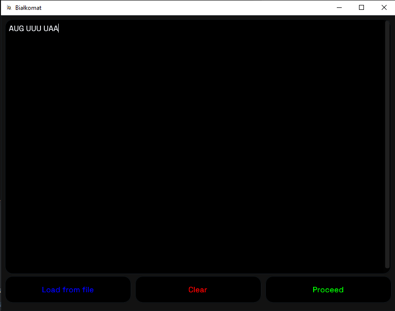
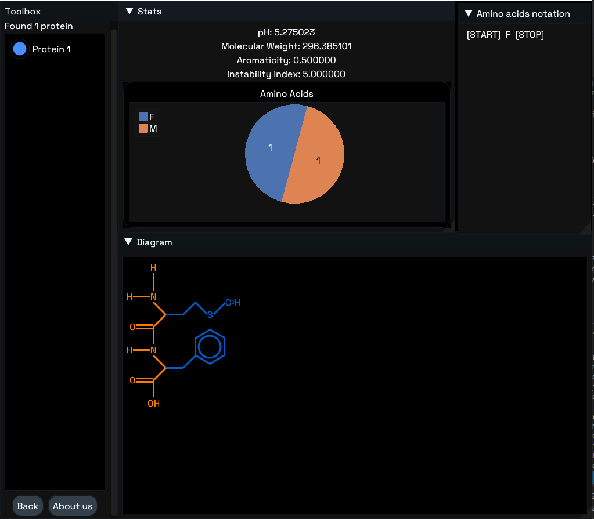

Language: pl

# INTRO

Ten dokument opisuje bardzo ogólną wizję
projektu BioIT do konkursu Motorola Science Cup.

# REFERENCJE

- [dokument opisujący zadanie](https://science-cup.pl/wp-content/uploads/2022/11/MSC3_2022_Bioinformatyka.pdf)

## TECHNOLOGIE

- Języki: [GO](https://golang.org/), C, [Python](https://www.python.org/)
- Framework Graficzny:
    * [giu](https://github.com/AllenDang/giu) (ewentualnie fork z autorskimi zmianami)
    * do wykresów [ImPlot](https://github.com/epezent/implot) (obecnie część giu)
- obsługa danych wejściowych (json): wbudowane narzędzia GO
- Framework do testów jednostkowych: [testify](https://github.com/stretchr/testify)

# WYKONANIE

odnoszę się tutaj do części PDFa z [referencjami](#referencje)

## Odczyt kodu genetycznego

<details>

### zczytanie z pliku/wejścia

nie powinno to sprawić praktycznie żadnych problemów.
wczytywanie takiego typu danych z pliku to bułka z masłem
a z "klawiatury" nie jest to trudniejsze (pole w aplikacji to pointer do stringa)

weryfikacja wprowadzonych danych - nie mogą zawierać nadprogramowych liter:
- A C G U dla RNA
- A C G T dla DNA
- jeżeli inna litera -> zgłoś błąd
- jeżeli zarówno T jak i U -> zgłoś błąd

wejściowe dane konwertujemy do wersji RNA żeby nie było
problemów z 2 typami

### dzielenie kodu na trójki (kodony)

jak mówi PDF:
"Ponieważ [...] można rozpocząć od dowolnego miejsca kodu,
Odczyt należy wykonać trzykrotnie" (z odpowiednim przesunięciem)

czyli:
* kod: `ABCDEFGH`
* v1: `ABC DEF`
* v2: `BCD EFG`
* v3: `CDE FGH`

### konwersja na aminokwasy:

Poniższy schemat przedstawia sposób konwersji
kodonów (potrójnych sekwencji) na aminokwasy:


na tym etapie proponowałbym zrobić prostego JSONa
```json
[
    {
        "Codes": [
            "AAA",
            "AAG",
        ],
        "LongNam": "Lysocośtam",
        "ShortName": "lys",
        "Sign":"K"
    },
    {
        "Codes": [
            "UAG",
            "UAA",
            "UGA"
        ],
        "LongNam": "Kod STOP",
        "ShortName": "stop",
        "Sign":"STOP"
    },
]
```

proponowałbym teraz po stronie GO zrobić takie struktury:
- liste konstansów odpowiadających aminokwasom + string2enum który by
  konwertował znaczek z jsona do GO
- typ (`type` - jak klasa w innych językach) odpowiedzialny za
  "pasowanie" do jsona i wczytywanie go

i tak mielibyśmy już ładną pseudo bazedanych
i binding w GO

**EWENTUALNIE**

nie bawić się z JSONEM i od razu lecieć w GO
(wtedy baza byłaby jako plik `data.go`)

### Konwersja na białka

typ (klasa) BIAŁKO powinna być tablicą ww. aminokwasów.
za białko uznajemy tylko taki set, którego BIAŁKO.aminokwasy[0] == start &&
BIAŁKO.aminokwasy[-1] == STOP

### prezentacja literek na ekranie

IMO nie ma co wydziwiać - po prostu walnąć
"TreeNode" które rozwija "zwrapowany" ładnie tekst

więcej w sekcji [o UI](ui)

</details>

## Wizualizacja kandydatów na białka

<details>
no tutaj troche zabawy będzie.

Mówiąc troche mam na myśli BAAARDZO DUŻO

Mój plan przewiduje stworzenie pakietu-fabryki
takich schemacików. Miałby on używać implota (wykresów)
żeby rysować te rysunki. Plusy są takie:
- nienajgorszy wygląd graficzny (użydkownik może przesuwać wykres i nie zajmuje on za dużo miejsca)
- implot nie jest chyba super trudny (nie używałem wykresów w giu tbh)

</details>

## liczenie masy

To proste sumowanie mas aminokwasów, więc nie trudne.

## Jeszcze więcej wykresów i diagramów

Niestety wzory nie są proste, **ale** Podczas szukania  biblioteki natknęliśmy się z @Garnn na BioPython,
który zawiera już potrzebne implementacje. Kontynuując dalsze poszukiwania próbowaliśmy
zaimplementować Pythona w GO!
Polega to na tym, że istnieje CGO - integralna część języka pozwalająca wintegrować
C, a Python posiada CPython - zestaw headerów czyli jest to możliwe.
Aby uniknąć niepotrzebnej dodatkowej implementacji zastosowaliśmy bibliotekę go-embed-python (https://github.com/kluctl/go-embed-python)

Poniższe referencje mogą okazać się ciekawe:
- przykład: https://poweruser.blog/embedding-python-in-go-338c0399f3d5
- temat na go forum: https://forum.golangbridge.org/t/use-python-in-go-code/30503
- Problem na GitHubie w jednym z repozytoriów: https://github.com/go-python/cpy3/issues/33

</details>

to właśnie po to ImPlot - te wykresy powinny być
całkiem proste do zrobienia tylko trzeba znaleźć wzory.

### Punkt izoelektryczny

Po rozmowie z [Chatem GPT](https://chat.openai.com) na temat punktów izoelektrycznych, wymyśliliśmy następujący kod:

```go
package main

import (
    "fmt"

    "github.com/biogo/biogo/seq"
    "github.com/biogo/biogo/seq/acid"
)

func main() {
    protein := "MVKVFGVGGG"
    p := seq.NewPeptide(acid.Alphabet, []byte(protein))
    pI := p.IsoelectricPoint()

    fmt.Printf("The isoelectric point of the protein is %.2f\n", pI)
}
```

Teraz tylko wystarczy zweryfikować i może mamy punkt izoelektryczny :smile:

# UI




# PODSUMOWANIE

mam nadzieje że opis był zrozumiały.
Wykonanie nie powinno być zbyt trudne.
_czekamy teraz klasyczne 10 minut później_
